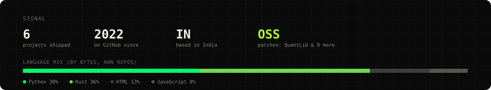

<picture>
  <source media="(prefers-color-scheme: dark)" srcset="assets/banner.svg" />
  <source media="(prefers-color-scheme: light)" srcset="assets/banner-light.svg" />
  
</picture>

### The short version

Engineer → SaaS founder/operator → MBA → investment banking. Somewhere in
there I picked up the habit of not trusting a number until I've rebuilt the
model myself — which, if I'm honest, is really just an excuse to keep
writing code for a living after finance told me to stop.

Based in India. On a given night I am equally likely to be arguing with an
EBITDA bridge in a spreadsheet or with a segfault in a terminal, and
neither argument is going noticeably better than the other.

A DCF and a `git rebase` have more in common than people think: both are
just you insisting, with great confidence, that the past can be tidied up
into a story that leads cleanly to the number you already believe.

**The question I keep asking:** does the tool actually help me *understand*
the business, or does it just make the output look confident? Most finance
software optimizes for the second one. I'd rather build the first — even
if that means the "financial model" is a Python script with opinions.

 

### What I've actually shipped

<!-- AUTO:projects:start -->
<table width="100%">
<tr>
<td width="33%" valign="top">

**[photoface](https://github.com/heykav/photoface)**

Face detection (YuNet) + embeddings (SFace), clustered with a greedy online pass and then a proper average-linkage recluster — and once you manually correct a face, it's *pinned*: the algorithm is no longer allowed to have opinions about that one.

`Python` `PySide6` `OpenCV`

</td>
<td width="33%" valign="top">

**[pe-financial-calculator](https://github.com/heykav/pe-financial-calculator)**

LBO modeling, DCF analysis, deal-analysis tooling — the thing I actually underwrite with, not a portfolio-piece demo. If a sensitivity table lies to you, it's this one's fault, and I'd want to know.

`JavaScript` `HTML/CSS`

</td>
<td width="33%" valign="top">

**[fpga-sim-core](https://github.com/heykav/fpga-sim-core)**

Cycle-accurate FPGA datapath sim: deterministic callback scheduling, PCS encode/decode, a five-level order book, zero heap allocation on the hot path — because "close enough" isn't a real answer at the clock-cycle level.

`C++` `CMake`

</td>
</tr>
<tr>
<td width="33%" valign="top">

**[vanna](https://github.com/heykav/vanna)**

Named after the real second-order Greek. Prices options from first principles (Black-Scholes, a binomial tree for early exercise) instead of bucketing historical fills, then decomposes every trade's P&L into delta/gamma/theta/vega/vanna/volga via a Taylor expansion — with the leftover reported honestly as residual, not hidden in whichever bucket makes the total look clean.

`Python` `PySide6` `NumPy`

</td>
<td width="33%" valign="top">

**[microprice-rust](https://github.com/heykav/microprice-rust)**

A research-grade, high-performance Rust implementation of Markov-chain limit-order-book micro-price estimation.

`Rust` `HTML`

</td>
</tr>
</table>
<!-- AUTO:projects:end -->

 

### Patches upstream

<!-- AUTO:patches:start -->
[**QuantLib**](https://github.com/lballabio/QuantLib/pull/2779) — the C++ library half of quant finance is quietly built on — had a `NaN` hiding in its Gauss-Laguerre quadrature: past order ~200, one of the weights underflows to exactly `0.0`, and `inf × 0` in IEEE 754 is `NaN`, no questions asked. The fix isn't "add an epsilon and pray," it's re-deriving the weight in log-space so the underflow never has anywhere to hide — tested against the real consumer (`AnalyticHestonEngine`) and independently re-derived in NumPy just to be sure I wasn't fooling myself.

[**edgartools**](https://github.com/dgunning/edgartools/pull/1318) — much smaller, and I'll say so: the quickstart claimed Python 3.8 while `pyproject.toml` actually required 3.10, and its own docs quietly recommended a `cash_flow_statement()` alias that's deprecated for removal in v6.0. No math, just paying enough attention to notice the docs were lying to new users — merged.

One of these is a rigor problem, the other is a reading-comprehension problem. Both count.
<!-- AUTO:patches:end -->

 

### Stack

 

<!-- AUTO:statsalt:start -->
<picture>
  <source media="(prefers-color-scheme: dark)" srcset="assets/stats.svg" />
  <source media="(prefers-color-scheme: light)" srcset="assets/stats-light.svg" />
  
</picture>
<!-- AUTO:statsalt:end -->

  

**[GitHub](https://github.com/heykav)** · **[Website](https://krishnaanubhav.com)** · **[X](https://x.com/heykav)**

