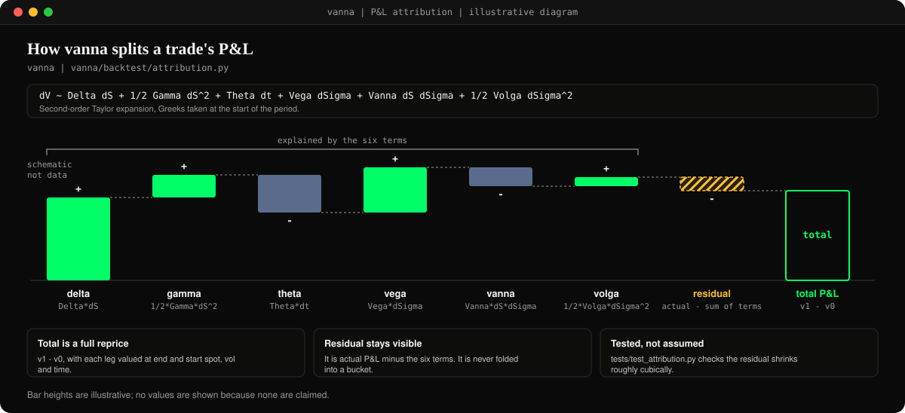
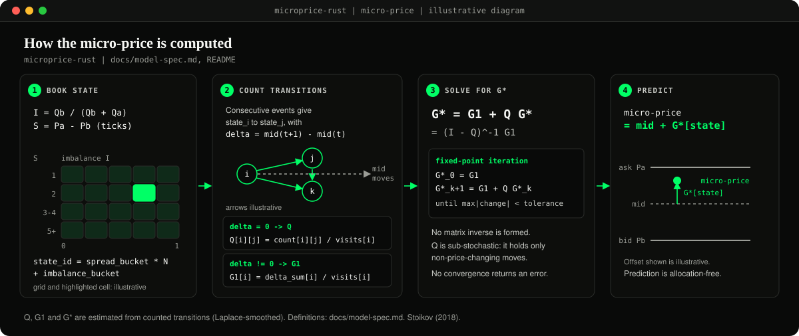
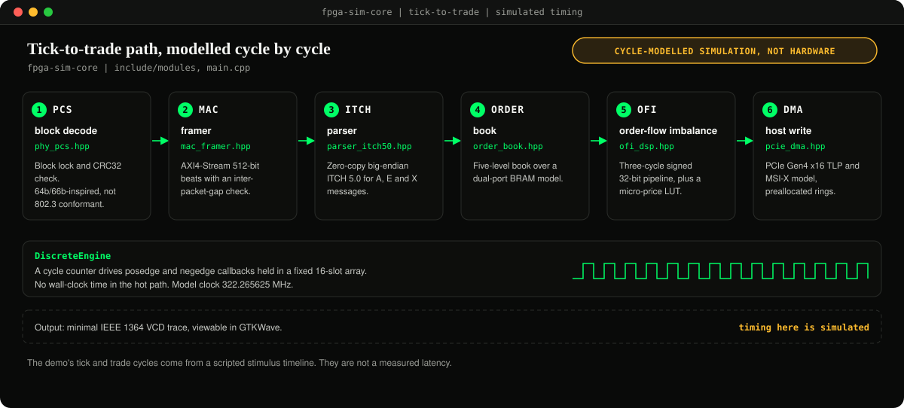

<picture>
  <source media="(prefers-color-scheme: dark)" srcset="assets/banner.svg" />
  <source media="(prefers-color-scheme: light)" srcset="assets/banner-light.svg" />
  
</picture>

<a href="#about">About</a> ·
<a href="#selected-work">Selected work</a> ·
<a href="#patches-upstream">Patches upstream</a> ·
<a href="#how-i-work">How I work</a> ·
<a href="#contact">Contact</a>

### About

I started as an engineer, ran a SaaS company, did an MBA, and now work in investment banking. I am based in India. The habit that stayed with me through all of it is not trusting a number until I have rebuilt the model that produced it.

Most evenings go to either an EBITDA bridge or a segfault, and the two have more in common than they look: each one punishes an assumption you did not know you were making.

The question I keep asking of a tool, my own included, is whether it helps me understand a business or only makes its output look confident. The projects below are my attempts at the first kind. Each README says what the code does not do, and where a result is negative, it says so.

 

### Selected work

<!-- AUTO:projects:start -->
<table width="100%">
<tr>
<td width="33%" valign="top">

**[vanna](https://github.com/heykav/vanna)**

Options pricing and P&L attribution in Python. It prices with Black-Scholes and a binomial tree for early exercise, then splits each trade's P&L into delta, gamma, theta, vega, vanna and volga with a second-order Taylor expansion, plus a dividend term when a yield is set. What those terms do not explain is reported as a residual instead of being absorbed into a bucket. Closed-form prices and Greeks agree with QuantLib and py_vollib to about 1e-12; the binomial tree is about 7x slower than QuantLib's. Backtests run on simulated price paths only.

`Python` `PySide6` `NumPy`

</td>
<td width="33%" valign="top">

**[pe-financial-calculator](https://github.com/heykav/pe-financial-calculator)**

Rivet, a browser-based LBO and DCF calculator for a first-pass look at a deal. It is illustrative: returns are gross, with no taxes, fees or three-statement model. The calculation core is a pure module tested against hand-computed values, and every formula is written out in the repo.

`JavaScript` `HTML/CSS`

</td>
<td width="33%" valign="top">

**[microprice-rust](https://github.com/heykav/microprice-rust)**

A Rust implementation of a micro-price estimator in the tradition of Stoikov (2018): a Markov chain over queue-imbalance and spread states that gives the mid-price plus an expected-move adjustment. It is research code, run on synthetic data only. On that data it does not beat the naive mid-price, and the README shows the numbers. The martingale property does not hold by construction here, and a diagnostic reports the drift. The evaluation protocol for real quote data is written and has not been run yet.

`Rust` `Market Microstructure`

</td>
</tr>
<tr>
<td width="33%" valign="top">

**[quantdeck](https://github.com/heykav/quantdeck)**

Event-driven backtesting in Python, one symbol at a time, market orders only. Orders fill at the next bar's open plus slippage, so a strategy cannot trade on a price it has not seen. It runs offline on CSV files and needs no database server. It is backtest only: no live or paper-trading engine exists.

`Python` `Backtesting`

</td>
<td width="33%" valign="top">

**[fpga-sim-core](https://github.com/heykav/fpga-sim-core)**

A C++20 cycle model of an FPGA-style tick-to-trade path: PCS-style block framing with CRC (not IEEE 64b/66b), a MAC framer, an ITCH 5.0 parser for add, execute and cancel messages only, a five-level order book, order-flow imbalance, a PCIe DMA model and VCD waveform output. Latency is counted in simulated cycles over a synthetic ITCH stream, using documented stage-latency parameters, so it is not a hardware or FPGA measurement. The paths covered by its allocation test perform no heap allocation.

`C++` `CMake`

</td>
<td width="33%" valign="top">

**[photoface](https://github.com/heykav/photoface)**

A local-first desktop app that finds faces in a photo library, clusters them, and lets you correct the result. Detection uses YuNet and embeddings use SFace, clustered in a greedy online pass and then re-clustered with average linkage. A face you fix by hand is pinned, and reclustering never moves it again.

`Python` `PySide6` `OpenCV`

</td>
</tr>
</table>
<!-- AUTO:projects:end -->

#### Recent changes

- **vanna**: benchmarks against QuantLib and py_vollib exposed an implied-vol precision bug and inaccurate binomial Greeks, both now fixed; a continuous dividend yield now runs through the backtest; `covered_call` now holds its stock leg.
- **pe-financial-calculator**: the calculation core was rewritten as a pure, tested module and nine correctness bugs were fixed, which moved the base case from 5.0x / 38.2% to 4.0x gross MOIC and 32.2% gross IRR.
- **microprice-rust**: an optional symmetrization, a diagnostic showing the martingale property does not hold by construction, an `evaluate-parquet` command and `predict_batch` in the Python bindings. It still does not beat the naive mid-price on synthetic data, and the real-data run is still pending.
- **quantdeck**: nine engine, broker and metrics correctness fixes with regression tests, an offline example that needs no network, and live-trading claims removed because no live engine exists.
- **fpga-sim-core**: latency now comes from a simulated-cycle pipeline over a synthetic ITCH stream, with an order-flow imbalance calculated from real book changes, valid VCD output, a wider allocation test and sanitizer CI.
- **photoface**: data-safety fixes (versioned migrations, atomic per-photo analysis, stricter EXIF parsing) and deterministic reclustering.

#### How three of them work

Drawn from each repo's code and docs as they stand on `main`. Anything schematic is labelled as illustrative.

**P&amp;L attribution in vanna.** A trade's P&amp;L is a full reprice at the end minus the start. It is split into delta, gamma, theta, vega, vanna and volga terms using Greeks from the start of the period; with a dividend yield, a dividend term is added to both sides. Whatever those terms miss is its own residual bar. Bar heights are illustrative.

<picture>
  <source media="(prefers-color-scheme: dark)" srcset="assets/diagrams/vanna-attribution.svg" />
  <source media="(prefers-color-scheme: light)" srcset="assets/diagrams/vanna-attribution-light.svg" />
  
</picture>

**The micro-price in microprice-rust.** The top of the book is reduced to a queue-imbalance and spread bucket. Transitions that leave the mid-price unchanged form `Q`, the average mid change from each state is `G1`, and `G*` is solved from `G* = G1 + Q G*` by fixed-point iteration. The estimate is the mid plus `G*` for the current state.

<picture>
  <source media="(prefers-color-scheme: dark)" srcset="assets/diagrams/microprice.svg" />
  <source media="(prefers-color-scheme: light)" srcset="assets/diagrams/microprice-light.svg" />
  
</picture>

**The tick-to-trade path in fpga-sim-core.** A packet is modelled through block decode, MAC framing, an ITCH 5.0 parser, an order book, an order-flow imbalance pipeline and a PCIe DMA model. This is a cycle-modelled simulation, not hardware: latency is counted in simulated cycles over a synthetic ITCH stream, using documented stage-latency parameters. The PCS stage is 64b/66b-style framing, not IEEE 802.3 conformant, and the parser handles ITCH add, execute and cancel messages only.

<picture>
  <source media="(prefers-color-scheme: dark)" srcset="assets/diagrams/fpga-tick-to-trade.svg" />
  <source media="(prefers-color-scheme: light)" srcset="assets/diagrams/fpga-tick-to-trade-light.svg" />
  
</picture>

 

### Patches upstream

These are pull requests I have opened on other people's projects. Most are bug, documentation or packaging fixes; a few are enhancements or list additions, two of which add my own vanna to a curated list.

<!-- AUTO:patchsummary:start -->
As of 2026-10-08 there are 45: 16 merged, 24 open and 5 closed without merging.
<!-- AUTO:patchsummary:end -->

Open pull requests are waiting on review and are not shipped work. Counts and statuses are read from GitHub by `scripts/update_profile.py`, not written by hand.

<strong>The full list, grouped by status</strong>, including QuantLib, Qlib, zipline and Riskfolio-Lib.

<!-- AUTO:patches:start -->
#### Merged (16)

[**QuantLib**](https://github.com/lballabio/QuantLib/pull/2779) — the C++ quantitative finance library had a `NaN` in its Gauss-Laguerre quadrature. Past order ~200, one of the weights underflows to exactly `0.0`, and `inf × 0` is `NaN` in IEEE 754. The fix re-derives the weight in log-space so the underflow no longer occurs. It is tested against the real consumer (`AnalyticHestonEngine`) and was independently re-derived in NumPy as a check.

[**edgartools**](https://github.com/dgunning/edgartools/pull/1318) — a much smaller fix. The quickstart stated Python 3.8 while `pyproject.toml` required 3.10, and it listed `cash_flow_statement()` twice, which hid that `cashflow_statement()` is the deprecated alias (removal planned for v6.0) and `cash_flow_statement()` is the recommended name. No math, only documentation that gave new users incorrect information.

[**ever-gauzy**](https://github.com/ever-co/ever-gauzy/pull/10225) — a null-prototype object, a pattern used to avoid prototype-pollution bugs, crashed the utility function written to guard against prototype pollution. `Object.create(null)` has no `.constructor` to read `.name` from. The fix is one `getPrototypeOf` check.

[**ever-gauzy**](https://github.com/ever-co/ever-gauzy/pull/10209) — the project's security-disclosure badge pointed at a domain that no longer resolves (DNS `NXDOMAIN`, not a 404, which most link-checkers miss). The broken link was on the line explaining how to report a security issue, so it seemed worth fixing quickly.

[**Riskfolio-Lib**](https://github.com/dcajasn/Riskfolio-Lib/pull/257) — `Axes.plot_date` and `matplotlib.cm.get_cmap` were both removed in Matplotlib 3.11, but `requirements.txt` still says `>=3.9.2`. Anyone on a current install hits an `AttributeError` when plotting a portfolio.

[**trade-frame**](https://github.com/rburkholder/trade-frame/pull/9) — 37 images in the README that were never images: `` pointing at `.h` files and directories, which render as broken icons. Two of the targets had also been renamed `.h` → `.hpp` years earlier and the doc was never updated.

[**trade-frame**](https://github.com/rburkholder/trade-frame/pull/8) — asked where the meaning of an IQFeed trade-condition code comes from. Answer: nowhere in the repo, on purpose. IQFeed publishes the code table live over the same socket connection, so a hardcoded copy would go stale. Documented that mechanism instead of adding a table.

[**domokane/FinancePy**](https://github.com/domokane/FinancePy/pull/276) — `np.any(volatility) < 0.0`. `np.any()` on a non-empty array is already a bool before it meets the `< 0.0`, so the negative-volatility guard on FX option greeks could never fire. The sibling `delta()` method got this right (`np.any(v < 0.0)`); this one did not. Found by asking why two methods on the same class disagreed about how to validate the same input.

[**JerBouma/FinanceToolkit**](https://github.com/JerBouma/FinanceToolkit/pull/257) — fix: currency validation in format_portfolio_dataset only checks max string length.

[**jealous/stockstats**](https://github.com/jealous/stockstats/pull/206) — Fix VWMA producing NaN when rolling volume sum is zero.

[**man-group/ArcticDB**](https://github.com/man-group/ArcticDB/pull/3442) — Fix LibraryOptions/EnterpriseLibraryOptions.__eq__ crashing on non-matching types.

[**dcajasn/Riskfolio-Lib**](https://github.com/dcajasn/Riskfolio-Lib/pull/260) — Fix wrong asset column in All Assets relative constraints.

[**pmorissette/bt**](https://github.com/pmorissette/bt/pull/576) — Fix chained-assignment pattern in positions/outlays/get_transactions.

[**bashtage/arch**](https://github.com/bashtage/arch/pull/865) — TST: actually seed TestForecasting fixtures.

[**NandhaKishorM/laya**](https://github.com/NandhaKishorM/laya/pull/103) — Fix single-option choice question crash in DecisionModel.forward.

[**wangzhe3224/awesome-systematic-trading**](https://github.com/wangzhe3224/awesome-systematic-trading/pull/175) — Add vanna to Pricing.

#### Open, awaiting review (24)

[**matching-engine**](https://github.com/AsthaMishra/matching-engine/pull/2) — an out-of-range price and a malformed one were rejected with the identical error reason, so when debugging real order flow the log gave no way to tell which one had happened.

[**py_lets_be_rational**](https://github.com/vollib/py_lets_be_rational/pull/10) — no `LICENSE` file, which blocks `conda-forge` packaging for everyone downstream.

[**cody-special**](https://github.com/vollib/cody-special/pull/2) — `erf_cody` and `normaldistribution` were split into their own files, and the `@numba.njit` decoration that made them fast was not carried over.

[**jev-ultrafast**](https://github.com/browser-use/jev-ultrafast/pull/56) — the agent's browser target opens on `about:blank`, which is already `readyState == 'complete'` before the real navigation starts. The first poll after `Page.navigate` could read that stale state and give the policy a page that never loaded. The run then terminates as `BLOCKED` in under a second, which looks like the agent failing when the harness never observed anything real.

[**awesome-systematic-trading**](https://github.com/wangzhe3224/awesome-systematic-trading/pull/174) — checked all ~650 links in the list against the GitHub API and actual DNS resolution, not just an HTTP status code (which often gives false positives when sites block bots). Seven repos were genuinely gone. No replacements were guessed for the ones without a verified successor.

[**microsoft/qlib**](https://github.com/microsoft/qlib/pull/2357) — Microsoft's quant research platform threw a `DeprecationWarning` on `import qlib`, because a module-level constant was built with `pd.Timedelta("1day")` instead of the explicit-unit form. Same value, no warning, one-line fix.

[**pmorissette/ffn**](https://github.com/pmorissette/ffn/pull/405) — Fix rescale for DataFrames with axis=1.

[**skfolio/skfolio**](https://github.com/skfolio/skfolio/pull/404) — fix(portfolio): slice sample_weight per window in rolling_measure.

[**markedjs/marked**](https://github.com/markedjs/marked/pull/4127) — fix: keep a line starting with # but no space in the list item.

[**dateutil/dateutil**](https://github.com/dateutil/dateutil/pull/1598) — Fix rrule slicing with negative start or stop.

[**starship/starship**](https://github.com/starship/starship/pull/7770) — fix(utils): fix humanize_int rounding across unit boundaries.

[**cuemacro/findatapy**](https://github.com/cuemacro/findatapy/pull/59) — fix: calculate_log_returns raises TypeError instead of computing log returns.

[**alkaline-ml/pmdarima**](https://github.com/alkaline-ml/pmdarima/pull/623) — Fix: pmdarima.preprocessing.tests package never installed by meson build.

[**ranaroussi/yfinance**](https://github.com/ranaroussi/yfinance/pull/2977) — Fix dividends/splits/capital_gains returning None instead of empty Series on price fetch failure.

[**cvxgrp/cvxportfolio**](https://github.com/cvxgrp/cvxportfolio/pull/208) — Fix CSV loader to recognize non-nanosecond datetime dtypes.

[**convexfi/riskparity.py**](https://github.com/convexfi/riskparity.py/pull/37) — Fix default risk_concentration not being scale-invariant.

[**stefan-jansen/zipline-reloaded**](https://github.com/stefan-jansen/zipline-reloaded/pull/334) — BUG: fix TypeError ingesting csvdir bundles with splits/dividends on pandas 3.0.

[**cuemacro/finmarketpy**](https://github.com/cuemacro/finmarketpy/pull/83) — Fix short-only TechIndicator producing +1 signals instead of -1.

[**matplotlib/mplfinance**](https://github.com/matplotlib/mplfinance/pull/703) — Fix kwarg_help() crash on current pandas (trailing-comma .loc indexing).

[**stefan-jansen/empyrical-reloaded**](https://github.com/stefan-jansen/empyrical-reloaded/pull/55) — Fix rolling-window empty-index dtype, concat sort warning, scipy test regex.

[**stefan-jansen/pyfolio-reloaded**](https://github.com/stefan-jansen/pyfolio-reloaded/pull/69) — Fix deprecated positional Series indexing and dtype upcast warnings.

[**bukosabino/ta**](https://github.com/bukosabino/ta/pull/371) — Fix TSI tests: check_less_precise removed from pandas.

[**wilsonfreitas/awesome-quant**](https://github.com/wilsonfreitas/awesome-quant/pull/707) — Add vanna to Financial Instruments & Pricing.

[**PyPortfolio/PyPortfolioOpt**](https://github.com/PyPortfolio/PyPortfolioOpt/pull/764) — Add return_raw option to BlackLittermanModel.bl_weights.

#### Closed without merging (5)

[**Riskfolio-Lib**](https://github.com/dcajasn/Riskfolio-Lib/pull/258) — the constructor defined its own `returns` setter, including a type check, then bypassed it with `self._returns = returns`, so no validation ran. A single `NaN` in the input data does not fail at construction. It fails four stack frames deep inside `scipy.linalg.eigh`, with a message that has nothing to do with the actual data.

[**pysystemtrade**](https://github.com/pst-group/pysystemtrade/pull/1663) — two collection-breaking bugs unrelated to each other. One: a wildcard import three layers deep replaced `datetime` the class with `datetime` the module, so `datetime.strptime(...)` failed with an error that looks like a typo but is a namespace collision, hard to spot from the file that crashed. Two: an unescaped `\n` inside a docstring was interpreted as a real newline at parse time, which Python 3.12's doctest parser treated as an indentation problem.

[**ranaroussi/quantstats**](https://github.com/ranaroussi/quantstats/pull/548) — `cagr()` computed `abs(total + 1.0) ** (1/years) - 1`. With `compounded=False`, summed returns can go below −100%, and `abs()` flips negative terminal wealth positive, turning a −240% loss into a reported **+40% CAGR**. The maintainer shipped the fix directly in v0.0.82 rather than merging the PR, and wrote that "this release exists because of these reports."

[**tj/commander.js**](https://github.com/tj/commander.js/pull/2643) — Fix crash in Option.attributeName() on doubled/trailing hyphen in option flags.

[**rsheftel/pandas_market_calendars**](https://github.com/rsheftel/pandas_market_calendars/pull/487) — Fix timezone-dependent failure in test_valid_days_tz_aware.
<!-- AUTO:patches:end -->

<!-- AUTO:statsalt:start -->
<picture>
  <source media="(prefers-color-scheme: dark)" srcset="assets/stats.svg" />
  <source media="(prefers-color-scheme: light)" srcset="assets/stats-light.svg" />
  
</picture>
<!-- AUTO:statsalt:end -->

 

### How I work

Changes are tested before they are merged, and claims in the READMEs are checked against the code, so a claim that does not hold gets corrected rather than kept.

 

### Contact

**[GitHub](https://github.com/heykav)** · **[Website](https://krishnaanubhav.com)** · **[X](https://x.com/heykav)**
